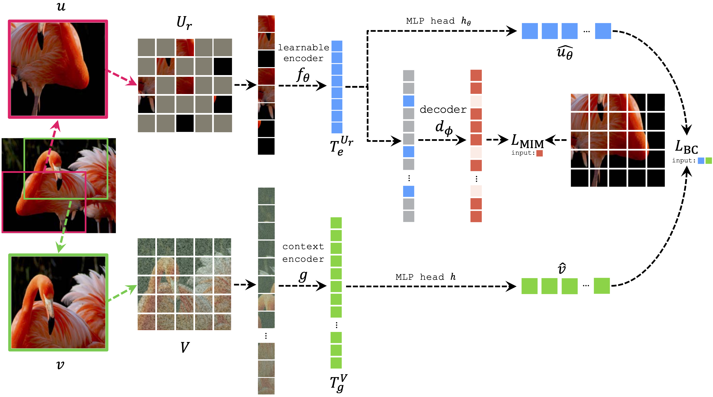

## Learning with Unmasked Tokens Drives Stronger Vision Learners

[Taekyung Kim*](https://scholar.google.co.kr/citations?user=u-9bdkwAAAAJ&hl=en), [Sanghyuk Chun](https://sanghyukchun.github.io/home), [Byeongho Heo](https://sites.google.com/view/byeongho-heo/home), [Dongyoon Han*](https://sites.google.com/site/dyhan0920/) <br>
<sub> (*equal contribution) <br>

[NAVER AI LAB](https://naver-career.gitbook.io/en/teams/clova-cic/ai-lab)

Official PyTorch implementation of LUT "Learning with Unmasked Tokens Drives Stronger Vision Learners" | [arxiv](https://arxiv.org/abs/2310.13593v2).
<br>

### Abstract

> Masked image modeling (MIM) has become a leading self-supervised learning strategy. MIMs such as Masked Autoencoder (MAE) learn strong representations by randomly masking input tokens for the encoder to process, with the decoder reconstructing the masked tokens to the input. However, MIM pre-trained encoders often exhibit a limited attention span, attributed to MIM’s sole focus on regressing masked tokens only, which may impede the encoder’s broader context learning. To tackle the limitation, we improve MIM by explicitly incorporating unmasked tokens into the training process. Specifically, our method enables the encoder to learn from broader context supervision, allowing unmasked tokens to experience broader contexts while the decoder reconstructs masked tokens. Thus, the encoded unmasked tokens are equipped with extensive contextual information, empowering masked tokens to leverage the enhanced unmasked tokens for MIM. As a result, our simple remedy trains more discriminative representations revealed by achieving 84.2% top-1 accuracy with ViT-B on ImageNet-1K with 0.6%p gain. We attribute the success to the enhanced pre-training method, as evidenced by the singular value spectrum and attention analyses. Finally, our models achieve significant performance gains at the downstream semantic segmentation and fine-grained visual classification tasks; and on diverse robust evaluation metrics.



*<p align="center">Framework overview</p>*
  
## Updates
  * (07/2024) LUT is accepted at ECCV 2024 


## Citation
```
@article{kim2024lut,
    title={Learning with Unmasked Tokens Drives Stronger Vision Learners},
    author={Kim, Taekyung and Chun, Sanghyuk and Heo, Byeongho and Han, Dongyoon},
    year={2024},
    booktitle={European Conference on Computer Vision (ECCV)},
}
```

